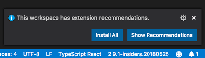

# 🔥 ESLint 速配指南

## 🚀 本文解决的问题

- 什么是 ESLint，有什么用？
- 结合 react、 typescript, ESLint 如何配置？
- 如何在 vscode 中实现自动保存？

## 什么是 ESLint，有什么用？

ESLint 是一种静态代码分析工具，可帮助识别和修复代码中的问题。

如下，如果尝试在定义某个变量之前访问这些变量，则会抛出 ReferenceError。

```javascript
console.log(a);
let a = 2;
```

在 ESLint 中可以定义各种规则，在我们编写代码的时候提示相应的错误。

## 结合 react、prettier, typescript，ESLint 如何配置？

在项目对应的根目录下创建 .eslintrc.js 文件，这是 ESLint 的配置文件，我们先从最基本的字段讲起，如下：

```javascript
module.exports = {
  /**
   * @zh 别人可以直接使用你配置好的 ESLint, ESLint 一旦发现配置文件中有 "root": true，它就会停止在父级目录中寻找
   */
  root: true,
   /**
    * @zh node 或者浏览器中的全局变量很多，如果我们一个个进行声明显得繁琐,因此就需要用到env，这是对环境定义的一组全局变量的预设
   */
  env: {},
  /**
   * @zh extends 可以看做是去集成一个个配置方案的最佳实践
   * eslint 开头的 ESLint 官方扩展有两个：eslint:recommended（推荐规范）和eslint:all（所有规范）。
   * plugin 开头的扩展是插件类型扩展
   * eslint-config 的 npm 包，使用时可以省略 eslint-config-
   * @ 开头的扩展,是在npm包上面加了一层作用域 scope
   * 需要注意的是：多个扩展中有相同的规则，以后面引入的扩展中规则为准
   */
  extends: [],
  /**
  * @zh 此部分指定用于解析代码的解析器。在本例中，指定为 TypeScript 解析器
  */
  parser: "@typescript-eslint/parser",
  /**
   * @zh 指定解析器选项
   */
  parserOptions: {},
  /**
   * @zh 插件是一个 npm 包，通常输出规则。要确保这个包安装在 ESLint 能请求到的目录下。plugins属性值可以省略包名的前缀 eslint-plugin-。
   */
  plugins: [],
  /**
   * @zh 将在所有插件规则之间共享的数据
   */
  settings: {},
  /**
   * 0 or 'off'：关闭规则
   * 1 or 'warn'：开启警告
   * 2 or 'error'：开启错误提示
   */
  rules: {},
}
```

接下来我们看看与 react 相关的 ESLint 配置：

### react 相关的 ESLint 配置

下载相关 npm 包
```javascript
npm i -D eslint eslint-plugin-react eslint-plugin-react-hooks
```

然后配置如下：

```javascript
module.exports = {
  extends: [
    "plugin:react/recommended",
    "plugin:react-hooks/recommended"
  ],
  parser: "@typescript-eslint/parser",
  parserOptions: {
    ecmaFeatures: {
      "jsx": true
    },
    ecmaVersion: 12,
    sourceType: "module"
  },
}
```

配置解读：

- 在 extends 中配置这些插件，例如 `plugin:react/recommended` 意思是采取了 eslint-plugin-react 中 react 官方推荐的最佳配置，这个推荐配置已经帮我们把 extends 属性、plugins 属性、rules 属性集合为这一个配置属性。

`plugin:react-hooks/recommended` 同理，是采用了 eslint-plugin-react-hooks 对 react hooks 官方默认最佳配置。

接下来，看看 typescript 跟 ESLint 相关的配置：

## typescript 相关配置

首先下载对应的 npm 包：
```javascript
npm i -D @typescript-eslint/parser @typescript-eslint/eslint-plugin eslint-plugin-import eslint-import-resolver-typescript typescript
```

- @typescript-eslint/parser: TypeScript 团队提供的 ESLint parser，用于实现支持 TypeScript 代码的 lint
- @typescript-eslint/eslint-plugin: ESLint 插件，包含一系列 TypeScript 相关的 ESLint 规则
- eslint-plugin-import 是对导入的模块进行排序，并防止文件路径和导入名称拼写错误的问题
- eslint-import-resolver-typescript 它为 eslint-plugin-import 提供了对 TypeScript 的全面支持。这意味着你可以更有效地管理和检查你的 TypeScript 项目中的导入和导出语句，并且支持 path 别名


```javascript
module.exports = {
  extends: [
    "plugin:@typescript-eslint/recommended",
    "plugin:import/recommended"
  ],
  parser: "@typescript-eslint/parser",
  settings: {
    "import/resolver": {
      typescript: {}
    }
  }
}
```

- plugin:@typescript-eslint/recommended： 包含了 @typescript-eslint/eslint-plugin 的官方推荐规则，同时自动在 plugin 引入了 '@typescript-eslint'，所以我们无需再次引入
- @typescript-eslint/parser: 表示使用 TypeScript 代码的 lint
- setting 的作用之前已经讲了，是将在所有插件规则之间共享的数据, 其中 eslint-plugin-import 在 setting 中有暴露 import/resolver 属性，这个属性是留给第三方包，来配置例如一些特殊情况帮助解析引入包的路径的，例如 typescript/webpack/vite 中使用了别名。这里我们使用了 eslint-import-resolver-typescript 包，也就是如下的 typescript 属性，用 typescript 的配置文件来帮助解析别名。
```javascript
settings: {
    "import/resolver": {
      typescript: {}
    }
  }
```
prettier 是用来格式化前端代码的工具，它跟 eslint 结合的用法介绍，之前的文章已经有详细介绍，这里综合 prettier 的配置，根目录下创建 .eslintrc.js 文件，配置内容如下：

```javascript
/**
  * @zh plugins 字段和 extends 字段的区别,恶心、、
  * @en The difference between plugins and extends, If you have rules that aren't in eslint, you need the plugin to extend them
*/
module.exports = {
   /**
    * @zh node 或者浏览器中的全局变量很多，如果我们一个个进行声明显得繁琐,因此就需要用到env，这是对环境定义的一组全局变量的预设
    * @en There are many global variables in node or browser, it would be cumbersome if we declare them one by one, So we need to a preset for a set of global variables defined
   */
  "env": {
    browser: true,
    commonjs: true,
    es2021: true,
    node: true,
    jest: true,
  },
  /**
   * @zh extends 可以看做是去集成一个个配置方案的最佳实践
   * eslint 开头的 ESLint 官方扩展有两个：eslint:recommended（推荐规范）和eslint:all（所有规范）。
   * plugin 开头的扩展是插件类型扩展
   * eslint-config 的 npm 包，使用时可以省略 eslint-config-
   * @ 开头的扩展,是在npm包上面加了一层作用域 scope
   * 需要注意的是：多个扩展中有相同的规则，以后面引入的扩展中规则为准。
   * @en extends can be seen as the best practice about configuration
   * There are two official ESLint extensions starting with eslint word: eslint:recommended (recommended specification) and eslint:all (all specifications).
   * Extensions starting with plugin are plugin extensions
   * Npm package starting with eslint-config- that can be omitted when using
   * The extension at the beginning of @ is to add a scope to the npm package
   * It should be noted that if multiple extensions have the same rules,the rules in the extends introduced early will be overwritten.
   */
  "extends": [
    "plugin:react/recommended",
    "plugin:react-hooks/recommended",
    "plugin:@typescript-eslint/recommended",
    "plugin:prettier/recommended",
    "plugin:import/recommended"
  ],
  /**
  * @zh 此部分指定用于解析代码的解析器。在本例中，指定为 TypeScript 解析器
  * @en This section specifies the parser to use for parsing the code. In this case, it specifies the TypeScript parser
  */
  "parser": "@typescript-eslint/parser",
  /**
   * @zh 指定解析器选项
   * @en this section specifies the parser options
   */
  "parserOptions": {
    "ecmaFeatures": {
    /**
      * @zh 启用 JSX，支持 JSX 语法并不等同于支持 React。React 对 JSX 语法应用了特定的语义，而 ESLint 并不能识别。如果你使用 React 并且使用 React 语法，我们建议使用 eslint-plugin-react。
      * @en By default, the sourceType is "module" for .js and .mjs files, and "commonjs" for .cjs files
     */
      "jsx": true
    },
    /**
      * @zh support ECMAScript version
      * @en By default, the sourceType is "module" for .js and .mjs files, and "commonjs" for .cjs files
     */
    "ecmaVersion": 12,
    /**
      * @zh 你sourceType：默认情况下，.js 和 .mjs 文件的 sourceType 是 "module"，而 .cjs 文件则是 "commonjs"
      * @en By default, the sourceType is "module" for .js and .mjs files, and "commonjs" for .cjs files
     */
    "sourceType": "module"
  },
  /**
   * @zh 插件是一个 npm 包，通常输出规则。要确保这个包安装在 ESLint 能请求到的目录下。plugins属性值可以省略包名的前缀 eslint-plugin-。
   * 插件一个主要的作用就是补充规则，比如eslint:recommended中没有有关react的规则，则需要另外导入规则插件eslint-plugin-react
   * @en A plugin is an npm package that typically exports rules. Make sure the package is installed in a directory
   * where ESLint can request it.The plugins attribute value can omit the prefix eslint-plugin- of the package name.
   * One of the main functions of the plugin is to supplement rules,for example, if there are no rules about react
   * in eslint:recommended, you need to import the rule plugin eslint-plugin-react
   */
  plugins: [],
  /**
   * 0 or 'off'：close rule(关闭规则)。
   * 1 or 'warn'：enable the rule，treat it as a warning(does not cause the program to fail) 并将其视为一个警告（不会导致程序失败)
   * 2 or 'error'：enable the rule, treat it as a bug (which will cause the program to fail if not fixed) 打开规则，并将其视为一个错误（如果不修复，将导致程序失败）
   */
  rules: {
    "no-use-before-define": "off",
    "@typescript-eslint/no-use-before-define": [ "error" ],
    "react/jsx-filename-extension": [ "warn", { "extensions": [ ".tsx" ] } ],
    "import/extensions": [ "error", "ignorePackages", { "ts": "never", "tsx": "never" } ],
    "no-shadow": "off",
    "@typescript-eslint/no-shadow": [ "error" ],
    "@typescript-eslint/explicit-function-return-type": [ "error", { "allowExpressions": true } ],
    "max-len": [ "warn", { "code": 100, "ignoreComments": true, "ignoreUrls": true } ],
    "react-hooks/rules-of-hooks": "error",
    "react-hooks/exhaustive-deps": "warn",
    "import/prefer-default-export": "off",
    "react/prop-types": "off",
    "prettier/prettier": [ "error", { "endOfLine": "auto" } ]
  },
  "settings": {
    "import/resolver": {
      "typescript": {}
    }
  }
}
```

## 简化配置

其实可以简化上面的 prettier 配置，如下：

```javascript
{
  "extends": ["plugin:prettier/recommended"]
}
```

官方文档提示，这跟上面提到的的 prettier 配置是等价的，所以，一般情况，使用这个配置覆盖 Eslint。

## Prettier 配置字段详解

除了覆盖 ESLint 冲突的功能，我们还需要自己配置一下，如何格式化我们的代码。

首先，新建 .prettierrc.js 文件，并写入以下内容：

```javascript
module.exports = {
  /**
   * @zh 行尾需要有分号
   * @en A semicolon is required at the end of the line
   */
  semi: true,
  /**
   * @zh 使用单引号
   * @en use single quotes
   */
  singleQuote: true,
  /**
   * @zh Jsx 不使用单引号，而使用双引号
   * @en Instead of using single quotes, use double quotes in Jsx
   */
  jsxSingleQuote: false,
  /**
   * @zh 不使用 Tab 缩进，而使用空格
   * @en Instead of using Tab indent, use spaces
   */
  useTabs: false,
  /**
   * @zh 使用 2 个空格缩进
   * @en Indent with 2 spaces
   */
  tabWidth: 2,
  /**
   * @zh 一行最多 140 字符
   * @en Maximum 140 characters per line
   */
  printWidth: 140,
};
```

## ESLint 如何在 vscode 中自动格式化

首先我们需要在 vscode 应用市场下载 ESLint 插件

### 下载 ESLint 插件


注意，你自己的项目的 node_modules 中需要下载 eslint 和 eslint 相关的，例如 react、 prettier、typescript 相关的 eslint npm 包。

### 团队统一安装 ESLint 相关插件

在项目根目录，创建 .vscode 文件夹，然后创建 extensions.json 文件，文件写入：
```javascript
{
  "recommendations": [
    "dbaeumer.vscode-eslint", // eslint 插件
    "esbenp.prettier-vscode", // prettier 插件
    "stylelint.vscode-stylelint", // stylelint 插件
    "shardulm94.trailing-spaces",// editorConfig 插件
  ],
}
```

这样，vscode 会提示你安装对应插件，这样团队下载项目后，都会有提示下载对应插件，如下图：
