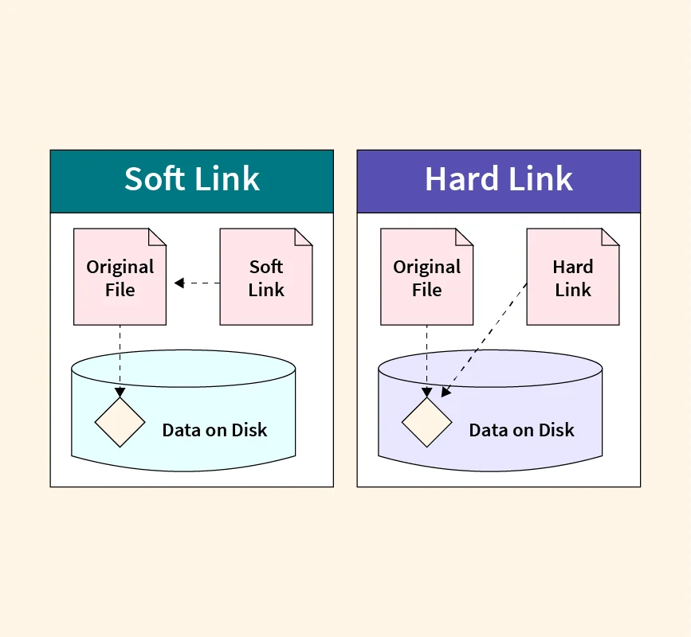

## yarn 和 npm 扁平化 node_modules 的问题

我总结下来有三点问题，后面会详细描述这些问题：
- 幽灵依赖，即部分你没有在 dependencies 中显式依赖的包，你也能引用
- node_modules 结构不确定
- 冗余问题，重复下载相同的包

### 幽灵依赖问题
npm 使用扁平化的 node_modules, 什么意思呢？

我们举一个例子，假设我们的项目需要在安装 express，express 包依赖另一个 debug npm 包。项目结构如下
```javascript
project
|--node_modules
    |--express
    |--debug
```

很明显，此时有什么问题呢？你可以直接在项目里 `require('debug')` 或者 `import xx from debug`;

这就是 扁平化的 node_modules 的问题之一。

### node_modules 结构不确定问题

与此同时
- 假设 express 升级了 debug 引用，并且 debug 包删除了一些 API，但是你在你的项目里引用了 debug 包会怎样？
- 假设 express 升级后，删除了 debug 包，你的项目引用了 debug 包又会怎样？

这就像一颗定时炸弹一般，这就是扁平化化 node_modules 的一大问题。

并且扁平化后的 node_modules 还有一个问题，就是整个项目的包结构很复杂，举个例子，例如我们有一个包 a, 它依赖了另一个包 b 的 1.0 版本，此时，扁平化的 node_modules 结构如下：
```javascript
project
|--node_modules
    |--a
    |--b@1.0
```

此时，我们又引入一个包，c, c 依赖了 b 的 2.0 版本，此时，node_modules 的结构就不一定了，假如 package.json 中如下：
```javascript
{
    "dependencies": {
        a: "^1.9.0",
        c: "^1.0.0",
    },
}
```

node_modules 结构相应如下：
```javascript
project
|--node_modules
    |--a
    |--b@1.0
    |--c
       |--b@2.0
```
注意下面的区别，

假如 package.json 中如下：

```javascript
{
    "dependencies": {
        c: "^1.0.0",
        a: "^1.9.0",
    },
}
```
node_modules 结构就会发生变化, 注意 b 包的版本
```javascript
project
|--node_modules
    |--c
    |--b@2.0
    |--a
       |--b@1.0
```

这也是为什么后面会出现 package-lock.json 的原因， package-lock.json 会把 node_modules 的结构固定，所以团队协作时，建议把 lock 文件传到共享仓库里。


yarn 也是类似的结构。

### 冗余问题
还有一点问题，根据我们上面的描述，是完全可能产生类似下面的场景的：
```javascript
project
|--node_modules
    |--a
    |--b@1.0
    |--c
       |--b@2.0
    |--d
       |--b@2.0
    |--e
       |--b@2.0
```
也就是出现同一个包，下载多次，而且不同的项目也不能共享。


## pnpm 如何解决这些问题

pnpm 使用硬链接和软连接来维护 node_modules 的结构。什么意思呢，我们举个例子，下面展示了安装 express 时，pnpm 中 node_modules 的结构

### 如何解决幽灵依赖

```javascript
project
|--node_modules
    |--express（symlink）
    |--.pnpm
      |--express
          |--4.0.0
              |--node_modules
                  |--express（hard link）
                  |--debug（symlink）
      |--debug
          |--1.0.0
              |--node_modules
                  |--debug（hard link）
```

我们发现，因为 project 的根 node_modules 下没有 debug 包，。

整个结构类似：项目根目录下的 node_modules ，只会存在 dependencies + devDependencies 的包， 所以幽灵依赖的问题就解决了。

### 名词解释，软连接和硬链接

后面会讲到 pnpm 的 node_modules 结构，此时必须对于软连接和硬链接是什么有所了解。

软连接和硬链接都是相对于原文件来说的。以下对操作系统的知识比较同学的解释。对于不熟悉操作系统的知识的同学来说，你可以很简单的认为，硬链接就是原文件的别名，大家都是一个文件，然后硬链接相当于起了个外号。软链接相当于 windows 中的快捷方式。


如果你操作系统的知识比较不错，我们可以简单解释为硬链接跟原文件都指向同一个 inode 节点（inode 节点会指向硬盘的真实数据），所以可以简单理解为，硬链接和源文件都是指向硬盘同一份数据。

软链接保存的是目标文件的路径，这个路径指向的 inode 的节点，跟原文件是同一个 inode 节点。



### 如何解决冗余问题


pnpm 下载的包会放到 pnpm-store 里，当我们使用 pnpm install 下载 npm 包的时候，pnpm 会先检查是否这些包在本地的 pnpm-store 中，如果在，就不去远程下载了，而是将 npm 包通过软连接 + 硬链的方式映射到项目的 node_modules 下。

并且 pnpm 在 node_modules 下会创建一个 .pnpm 文件夹来保存链接的 npm 包。
 
我们举个例子（案例来源于官网），假设您安装了依赖于 bar@1.0.0 的 foo@1.0.0。 pnpm 会将两个包硬链接到 node_modules 如下所示：
```javascript
node_modules
└── .pnpm
    ├── bar@1.0.0
    │   └── node_modules
    │       └── bar -> <store>/bar
    │           ├── index.js
    │           └── package.json
    └── foo@1.0.0
        └── node_modules
            └── foo -> <store>/foo
                ├── index.js
                └── package.json
```

首先真正的包，都是在 .pnpm 下的, 从上面来看，格式类似：
```javascript
.pnpm/<name>/<version>/node_modules/<name>
```

所以可以看到，bar 和 foo 真正的包其实是硬链接到本地的 pnpm-store 的。

假设 foo@1.0.0 依赖了 bar@1.0.0，node_modules 的结构会变成：
```javascript
node_modules
└── .pnpm
    ├── bar@1.0.0
    │   └── node_modules
    │       └── bar -> <store>/bar
    └── foo@1.0.0
        └── node_modules
            ├── foo -> <store>/foo
            └── bar -> ../../bar@1.0.0/node_modules/bar
```
可以看到 foo@1.0.0 下的 bar 其实就是 .pnpm 下的 bar@1.0.0 下的 bar，是通过软连接的形式链接过去的。


如果我们的 dependencies 中依赖了 foo@1.0.0，此时的 node_modules 结构如下

```javascript
node_modules
├── foo -> ./.pnpm/foo@1.0.0/node_modules/foo
└── .pnpm
    ├── bar@1.0.0
    │   └── node_modules
    │       └── bar -> <store>/bar
    └── foo@1.0.0
        └── node_modules
            ├── foo -> <store>/foo
            └── bar -> ../../bar@1.0.0/node_modules/bar
```

可以看到项目根目录下跟 .pnpm 同级多了一个 foo 包，这个 foo 包其实是 .pnpm 下 foo@1.0.0/node_modules/foo 的软连接。


这样下来，其实你会有点懵，各种软连接，硬链接交叉，我们还拿下面这个例子举例：
```javascript
node_modules
├── foo -> ./.pnpm/foo@1.0.0/node_modules/foo
└── .pnpm
    ├── bar@1.0.0
    │   └── node_modules
    │       └── bar -> <store>/bar
    └── foo@1.0.0
        └── node_modules
            ├── foo -> <store>/foo
            └── bar -> ../../bar@1.0.0/node_modules/bar
```
简单的结论就是：

- .pnpm/<name>/<version>/node_modules/<name> 中，一定会有一个硬链接到全局 pnpm-store，剩下的其它都是软连接，但软连接有两种情况
  - 一种是，.pnpm/<name>/<version>/node_modules/<name> 中，例如 .pnpm/foo@1.0.0/node_modules/bar 软连接到 bar 包硬链接的地址。
  - 一种是跟 .pnpm 同级的 foo 软连接到 -> ./.pnpm/foo@1.0.0/node_modules/foo，也就是 foo 包硬链接的地址。

所以总归最终都是靠硬链接到全局 pnpm-store 来共享一份 npm 包。

## npm、yarn、pnpm 常用命令对比

| npm command            | Yarn command              | pnpm equivalent           |
| ---------------------- | ------------------------- | ------------------------- |
| npm install            | yarn                      | pnpm install              |
| npm install [pkg]      | yarn add [pkg]            | pnpm add [pkg]            |
| npm uninstall [pkg]    | yarn remove [pkg]         | pnpm remove [pkg]         |
| npm update             | yarn upgrade              | pnpm update               |
| npm list               | yarn list                 | pnpm list                 |
| npm run [scriptName]   | yarn [scriptName]         | pnpm [scriptName]         |
| npx [command]          | yarn dlx [command]        | pnpm dlx [command]        |
| npm exec               | yarn exec [commandName]   | pnpm exec [commandName]   |
| npm init [initializer] | yarn create [initializer] | pnpm create [initializer] |

## pnpm ci/cd


拿 github 的 workflow 来说：
```yaml
jobs:
  build:
    runs-on: ubuntu-latest
    steps:
      - name: Checkout code
        uses: actions/checkout@v2
      - name: Set up Node.js
        uses: actions/setup-node@v2
        with:
          node-version: "16"
      - name: Cache pnpm store
        uses: actions/cache@v2
        with:
          path: ~/.pnpm-store
          key: ${{ runner.os }}-pnpm-store-${{ hashFiles('pnpm-lock.yaml') }}
      - name: Install dependencies with pnpm
        run: pnpm install
```