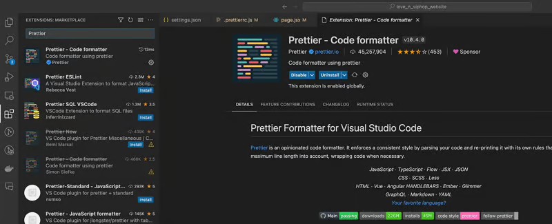

# 🔥 Prettier Quick Guide

## 🚀 Overview of Key Problem

- What is Prettier and what is it used for?
- Prettier and ESLint both format code, so how do you resolve conflicts to the same style?
- What are the common fields of an Prettier configuration file?
- How to configure prettier in vscode


## What is Prettier and what is it used for?

It is very common that multiple front-end developers maintain one project. So, consistent coding style is necessary.

> Consistent coding style refers to, for example, whether to use tabs or spaces for indentation. Note that prettier does not detect code quality issues, such as using undeclared variables, which will result in errors.

And if it can support automatic formatting, such as holding down 'ctrl + c' to save the code, it can automatically help us format our code into a unified style, which is great! 
 
Prettier is such a tool. 
 
 
## Prettier and ESLint both can format code, so how do you resolve conflicts? 
 
 
The main function of ESLint (including other lint tools) is to check code formatting and code quality, but the Prettier is to check code formatting, not code quality. 
 
Formatting conflicts are likely to occur when Prettier and ESLint are configured on the same project at the same time. 
 
The solution to conflicts is described in the next section. The idea is to override rules for conflicts between ESLint and Prettier.

Following this idea, we need to configure .eslintrc.js file. The following is the configuration of the .eslintrc.js file about Prettier:

First, we need some prettier plugins to help us,

```javascript
# Install prettier
ni -D prettier

# Install prettier plugin to integrate eslint library
ni -D eslint-plugin-prettier eslint-config-prettier
```

Then, in the root directory of the project, add the configuration of prettier to the .eslintrc.js file:

```Javascript
 {
  "extends": [
    "prettier"
  ],
  "plugins": ["prettier"],
  "rules": {
    "prettier/prettier": "error",
    'arrow-body-style': 'off'
    'prefer-arrow-callback': 'off',
  }
}
```

Parameter interpretation:

- extends: ['prettier']: Use eslint-config-prettier to turn off conflicting rules between eslint and prettier.
- plugins: ['prettier']: Load eslint-plugin-prettier, and enable eslint to use prettier to format documents
- 'prettier/prettier': 'error': Mark all code files that do not conform to prettier formatting rules as errors. Combined with the vscode eslint plugin, you can see these errors marked in red. When running the eslint --fix command, these errors will be automatically fixed.
- arrow-body-style and prefer-arrow-callback: These two rules have unsolvable conflicts in eslint and prettier, so turn them off.

## Simplify configuration

In fact, the above prettier configuration can be simplified as follows:
```javascript
{
"extends": ["plugin:prettier/recommended"]
}
```

The official document prompts that this is equivalent to the prettier configuration mentioned above, so in general, use this configuration to override Eslint.

## Detailed explanation of Prettier

In addition to overriding the ESLint conflict function, we also need to configure how to format our code.

First, create a new .prettierrc.js file and write the following content:

```javascript
module.exports = {
  /**
   * @en A semicolon is required at the end of the line
   */
  semi: true,
  /**
   * @en use single quotes
   */
  singleQuote: true,
  /**
   * @zh Instead of using single quotes, use double quotes in Jsx
   */
  jsxSingleQuote: false,
  /**
   * @en Instead of using Tab indent, use spaces
   */
  useTabs: false,
  /**
   * @en Indent with 2 spaces
   */
  tabWidth: 2,
  /**
   * @en Maximum 140 characters per line
   */
  printWidth: 140,
};
```

## Note

In vscode, if you modify the configuration options of .prettierrc.js and find new configuration not work, you need to restart vscode to avoid using cache.

## VSCode configuration formatting on save

- First, enter prettier in the VSCode store and download the prettier plugin. Then, you can open the command panel by pressing `Ctrl + Shift + P` (or `Cmd + Shift + P` on macOS) and enter the prettier character to verify whether the prettier command is available.


- Then select File > Preferences > Settings (or use Cmd + on macOS), and enter `Format on Save` in the search bar, and check Editor: `Format on Save`


