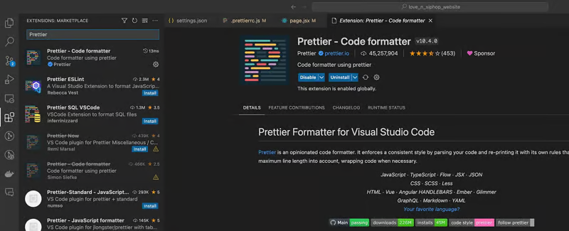

# 🔥 Prettier 速配指南

## 🚀 核心问题概览

- 什么是 Prettier，有什么用？
- Prettier 和 ESLint 都有格式化代码的作用，所以如何解决对同一样式格式化的冲突？
- Prettier 配置文件的常用字段含义是什么？
- vscode 如何配置？

## 什么是 Prettier，有什么用？ 

一个团队多个前端同学在维护一个项目是非常常见的事情。此时，一致的代码编写风格就很必要了。

>代码编写风格问题是，例如：缩进使用 tab 还是空格。需要注意 prettier 不监测代码质量问题，例如：使用未声明变量，提示错误。

并且如果可以支持自动格式化，例如按住 `ctrl + c` 保存代码时，能够自动帮我们把代码格式化为团队约定的统一风格，这可太棒了！

Prettier 就是这样的工具。


## Prettier 和 ESLint 都有格式化代码的作用，所以如何解决冲突？


ESLint（包括其他一些 lint 工具）的主要功能包含代码格式和代码质量的校验，而 Prettier 只是代码格式的校验，不会对代码质量进行校验。

所以在同一个项目同时配置 Prettier 和 ESLint 的时候，很有可能出现格式化冲突。


解决冲突的方案下一节会有介绍，思想就是覆盖 ESLint 和 Prettier 冲突的规则。

按照这个思路，我们在 ESLint 的配置文件中去写覆盖冲突的规则，以下是 .eslintrc.js 文件关于 Prettier 部分配置：

首先，我们需要一些 prettier 插件来帮助我们，

```javascript
# 安装 prettier
ni -D prettier

# 安装 prettier 整合 eslint 的库
ni -D eslint-plugin-prettier eslint-config-prettier
```

然后，在项目根目录下，.eslintrc.js 文件中加入有关 prettier 的配置：

```Javascript
 {
  "extends": [
    "prettier"
  ],
  "plugins": ["prettier"],
  "rules": {
    "prettier/prettier": "error",
    'arrow-body-style': 'off'
    'prefer-arrow-callback': 'off',
  }
}
```
参数解读：
- extends: ['prettier']: 通过 eslint-config-prettier 关闭 eslint 和prettier 相冲突的规则。
- plugins: ['prettier']: 加载 eslint-plugin-prettier，赋予 eslint 用 prettier 格式化文档的功能
- 'prettier/prettier': 'error': 让代码文件中不符合 prettier 格式化规则的都标记为错误，结合 vscode eslint 插件便可以看到这些错误被标记为红色，当运行 eslint --fix 命令时，将自动修复这些错误。
- arrow-body-style 和 prefer-arrow-callback: 这两个规则在eslint 和 prettier 中存在不可解决的冲突，所以关闭掉。

这里补充一下，有些同学不知道 ESLint 中 extends 字段，plugins 字段，还有 rules 字段的意思，解释如下：

- extends：可以看做是去集成一个个配置方案的最佳实践，注意 eslint-config 开头的npm包，使用时可以省略 eslint-config-，例如 eslint-config-prettier 使用时，可以直接只写 prettier
- plugins：插件一个主要的作用就是补充规则，比如 eslint:recommended 中没有有关 react 的规则，则需要另外导入规则插件 eslint-plugin-react。同时，plugins属性值可以省略包名的前缀 eslint-plugin-。所以 eslint-plugin-prettier 插件可以写成 prettier
- rules：上面定义的基本规则，可以在 rules 中再次覆盖

## 简化配置

其实可以简化上面的 prettier 配置，如下：
```javascript
{
  "extends": ["plugin:prettier/recommended"]
}
```

官方文档提示，这跟上面提到的的 prettier 配置是等价的，所以，一般情况，使用这个配置覆盖 Eslint。

## Prettier 配置字段详解

除了覆盖 ESLint 冲突的功能，我们还需要自己配置一下，如何格式化我们的代码。

首先，新建 .prettierrc.js 文件，并写入以下内容：

```javascript
module.exports = {
  /**
   * @zh 行尾需要有分号
   * @en A semicolon is required at the end of the line
   */
  semi: true,
  /**
   * @zh 使用单引号
   * @en use single quotes
   */
  singleQuote: true,
  /**
   * @zh Jsx 不使用单引号，而使用双引号
   * @en Instead of using single quotes, use double quotes in Jsx
   */
  jsxSingleQuote: false,
  /**
   * @zh 不使用 Tab 缩进，而使用空格
   * @en Instead of using Tab indent, use spaces
   */
  useTabs: false,
  /**
   * @zh 使用 2 个空格缩进
   * @en Indent with 2 spaces
   */
  tabWidth: 2,
  /**
   * @zh 一行最多 140 字符
   * @en Maximum 140 characters per line
   */
  printWidth: 140,
}
```


## 注意

在 vscode 中，如果修改了 .prettierrc.js 的配置选项后，发现 eslint 和 prettier 冲突了，需要重启 vscode，以免使用缓存，不能及时更新配置。

## vscode 配置保存时格式化（

- 首先，在 vscode 商店输入 prettier，然后下载 prettier 插件, 接着，你可以通过按 `Ctrl + Shift + P`（或 macOS 上的 `Cmd + Shift + P`）打开命令面板通过输入 prettier 字符，来验证是否 prettier 命令可用。


- 接着启动，选择 文件 > 首选项 > 设置（或在 macOS 上使用 Cmd + ），在搜索栏输入 `Format on Save` , 然后勾选 Editor：`Format on Save`


